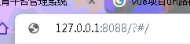
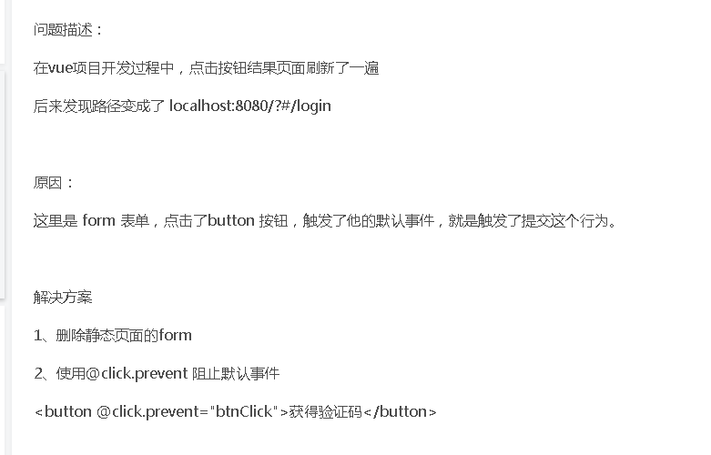
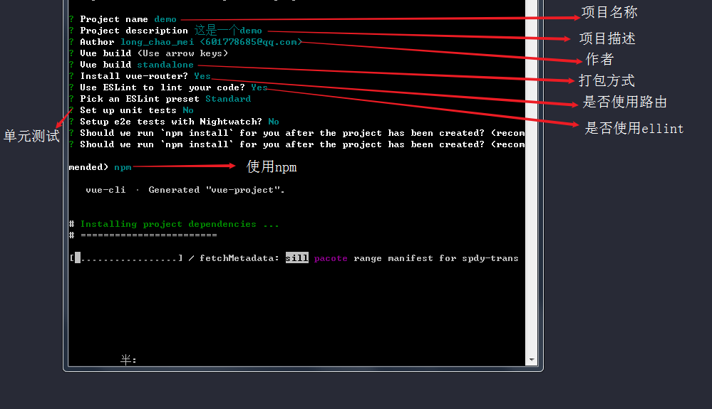

#### 1.封装本地储存

```js
const storage = {
set(key, value) {
    let val = value;
    if (typeof (val) === 'object') {
        val = JSON.stringify(val)
    }
    localStorage.setItem(key, val);
},
get(key) {
    return localStorage.getItem(key);
},
remove(key) {
    return localStorage.removeItem(key);
}
}
```


#### 2.封装axios请求

```javascript
import axios from 'axios';
// 服务器请求,needHeader参数用于判断是否需要认证
/**
 *
 * @param {String} url 请求的地址
 * @param {Object} data 请求参数
 * @param {String} method 请求方法(GET,POST等...)
 * @param {Boolean} needHeader 是否需要传token
 * @param {Boolean} getRes 是否将整体请求结果返回,主要用于分页
 * @param {Object} param 用于修改时需要带上参数到请求路径上
 */
const sendRequest = (url, data, method, needHeader, getRes, param) => {
  let headers = {};
  if (needHeader) {
    if (getRes) {
      headers = {
        token: storage.get('token'),
        Prefer: `count=exact`
      };
    } else {
      headers = {
        token: storage.get('token')
      };
    }
  }
  const xhr = axios.create({
    baseURL: baseURL,
    timeout: 10000
  });
  return new Promise((resolve, reject) => {
    if (method === 'GET') {
      var params = data;
      xhr({
          url,
          params,
          headers
        })
        .then(res => {
          if (getRes) {
            resolve(res);
          } else {
            resolve(res.data);
          }
        })
        .catch(err => reject(err));
    } else {
      var params = param;
      xhr({
          url,
          data,
          headers,
          method,
          params
        })
        .then(res => {
          if (getRes) {
            resolve(res);
          } else {
            resolve(res.data);
          }
        })
        .catch(err => reject(err));
    }
  });
};
```


#### 3.数组去重

```js
var hash = {}; //数组对象去重，选择出来
let newArr = arr.reduce(function(item, next) {
    hash[next.publication_item_title] ? "" : (hash[next.publication_item_title] = true && item.push(next));
    return item;
}, []);
```


#### 4.过滤数据

```js
let tmp = {};
let list = [];
for (const info of this.RperiodicalAll) {
    tmp[info.book_sku_id] = 1;
}
for (const info of data) {
    console.log(tmp[info.book_sku_id]);
    if (!tmp[info.book_sku_id]) {
        list.push(info);
    }
}
对this.RperiodicalAll循环  并赋值为1
第二个循环，循环第二个数组，将循环的key值放到tmp中判断，有值为1为true表示重复数据，对其取反当判断为false 就表示该数组中没有该数据，push到list中
```

#### 5.时间日期格式化 date-fns

```js
npm install date-fns --save
YYYY-MM-DD HH:mm:ss
format(result.rows[i].publish_date,"YYYY-MM-DD");
```


#### 6.PG数据库分页

```js
let req_data = {
    offset:(this.pageInfo.page - 1) * this.pageInfo.limit,
    limit:this.pageInfo.limit,
};
      
//得到数据后，解析响应头
let range = result.headers["content-range"]? result.headers["content-range"].split("/"): [];

this.pageInfo.total = Number(range[1]) >> 0;
```


#### 7.vue中路由跳转自动添加问号





#### 8.vue-cli 快速搭建项目

```js
下载vue-cli 	npm install -g vue-cli
镜像下载 	   npm install -g cnpm --registry=https://registry.npm.taobao.org
创建项目	   vue init webpack vue-web
Simple（太简单，就一个index.html文件）、webpack-simple（比较实用）、webpack（较全，内置有方法检查、单元测试等。） vue-cli3 ===> 更香
```




#### 9.将数据以表格形式导出

```js
 // 将数据以表格形式导出导出
    formatJson(filterVal, jsonData) {
      return jsonData.map(v => filterVal.map(j => v[j]));
    },
    export2Excel() {
      require.ensure([], () => {
        const { export_json_to_excel } = require("@/export2excel/Export2Excel");
	//表头键
       const tHeader = [ 
          "书号",
          "书名",
          "简称",
        ];
	//表头对应的数据key
        const filterVal = [
          "isbn",
          "publication_item_title",
          "publication_title_py",
        ];
        const list = this.excelList;//要导出的数据
        const data = this.formatJson(filterVal, list);
        export_json_to_excel(tHeader, data, "订单数据列表");//表名
      });
```

#### 10.时间倒计时和计时器

```js
function countdown () {
  // 目标日期时间戳
  const end = new Date('2017-12-01').getTime()
  // 当前时间戳
  const now = new Date().getTime()
  // 相差的毫秒数
  const msec = end - now
  // 计算时分秒数
  let day = parseInt(msec / 1000 / 60 / 60 / 24)
  let hr = parseInt(msec / 1000 / 60 / 60 % 24)
  let min = parseInt(msec / 1000 / 60 % 60)
  let sec = parseInt(msec / 1000 % 60)
  // 个位数前补零
  hr = hr > 9 ? hr : '0' + hr
  min = min > 9 ? min : '0' + min
  sec = sec > 9 ? sec : '0' + sec
  // 控制台打印
  console.log(`${day}天 ${hr}小时 ${min}分钟 ${sec}秒`)
  // 一秒后递归
  setTimeout(function () {
    countdown()
  }, 1000)
}


function timer(id) {
    var tFlag = 0
    var end = new Date('2017-10-15')
    var now = new Date()
    var tPass = now.getTime() - end.getTime();
    if (tFlag != 0) {
       var tNew = new Date().getTime();
       tPass = tPass + (tNew - tFlag);
       tFlag = tNew;
    } else {
        tFlag = new Date().getTime();
    }
    var sc = Math.floor((tPass / 1000) % 60);
    var mi = Math.floor((tPass / 1000 / 60) % 60);
    var hr = Math.floor((tPass / 1000 / 60 / 60) % 24);
    var dy = Math.floor(tPass / 1000 / 60 / 60 / 24);
     hr = hr > 9 ? hr : '0' + hr
  	 mi = mi > 9 ? mi : '0' + mi
     sc = sc > 9 ? sc : '0' + sc
    var info = "已经是" + dy + "天" + hr + "时" + mi + "分" + sc + "秒";
    consoloe.log(info)
    setTimeout(() => {
       timer('love')
      }, 1000);
    }
```

#### 11.绘制图标 echarts

###### [官网地址](https://echarts.apache.org/zh/tutorial.html#%E5%9C%A8%E5%BE%AE%E4%BF%A1%E5%B0%8F%E7%A8%8B%E5%BA%8F%E4%B8%AD%E4%BD%BF%E7%94%A8%20ECharts)

#### 12.SVG	字体图标

```html
<svg class="ad_icon">
    <use xlink:href="#k12huabanfuben" />
</svg>

<style>
.ad_icon {
  width: 24px;
  height: 24px;
  margin-right: 5px;
}
</style>

```

#### 13.移动端rem布局

[移动端开发屏幕适配](<http://git.isecsp.com/she_li_wei/vue-rem>)

```js
npm i lib-flexible  //在main.js中引入 lib-flexible   import 'lib-flexible/flexible'

npm i postcss-pxtorem  //新建postcss.config.js

```

```js
//postcss.config.js
module.exports = {
  plugins: {
    autoprefixer: {},
    'postcss-pxtorem': {
      rootValue: 37.5,
      propList: ['*']
    }
  }
}

```


#### 14.elementUi 级联选择器

```html
<el-cascader
    clearable
    :style="{width:'100%'}"
    v-model="form.category_name"
    :options="allClassify"
    :props="{ expandTrigger: 'hover',value:'id',label:'category_name',children:'sub_category' }"
    placeholder="请选择书籍分类"
    @change="handleChange">
</el-cascader>
```


```js
//获取所有的书籍分类
    AllCategory() {
      getAllCategory()
        .then(result => {
          result.forEach(element => {
       //应对数据可能出现一级分类选择或二级分类选择 进行判断修改
            if (element.sub_category.length < 1) {
              element.sub_category = undefined;
            }
            for (let i = 0; i < element.sub_category.length; i++) {
              if (element.sub_category[i].sub_category.length < 1) {
                element.sub_category[i].sub_category = undefined;
              }
            }
          });
          this.allClassify = result;
          console.log(result);
        })
        .catch(err => {
          this.$message({ message: "获取书籍分类失败！", type: "error" });
        });
    },
```

#### 15.表单验证

```html
<el-form :model="form" :rules="rules" ref="form" label-width="130px" class="demo-form-inline">
  <el-row>
    <el-col :span="10" :offset="1">
      <el-form-item label="出版社名称：" prop="press_name">
      	<el-input style="width:100%" v-model="form.press_name" placeholder="请输入出版社名称">
    	  </el-input>
	  </el-form-item>
    </el-col>
    <el-col :span="10" :offset="1">
       <el-form-item label="联系电话：" prop="contact_phone">
         <el-input
         v-model="form.contact_phone"
         @keyup.native="keyupMobile"
         maxlength="11"
         placeholder="请输入手机号码"
         ></el-input>
       </el-form-item>
     </el-row>
</el-form>
```

```js
data() {
    //自定义校验
    let checkMobile = (rule, value, callback) => {
      console.log(rule, value, callback);
      var regu = /^1(3|4|5|6|7|8|9)\d{9}$/;
      var re = new RegExp(regu);
      if (!value) {
        callback(new Error("电话号码不能为空，请输入电话号码"));
      } else if (!re.test(value)) {
        callback(new Error("电话号码格式错误，请输入电话号码"));
      } else {
        callback();
      }
    };
    };
    return {
      cityShow: false,
      rules: {
        //常规校验
        press_name: [
          { required: true, message: "请输入出版社名称", trigger: "blur" }
        ],
        //自定义校验
        contact_phone: [{ validator: checkMobile, trigger: "blur" }],
    }
}
        
```

#### 16.设置浏览器解析格式

```js
'Content-Type', 'text/plain; charset=utf-8'
```

#### 17.Map()方法

```js
const sweetArray = [2, 3, 4, 5, 35]
const sweeterArray = sweetArray.map(sweetItem => {
    return sweetItem * 2
})
 
console.log(sweetArray)   // [2, 3, 4, 5, 35]
console.log(sweeterArray)


const myUsers = [
    { name: 'chuloo', likes: 'grilled chicken' },
    { name: 'chris', likes: 'cold beer' },
    { name: 'sam', likes: 'fish biscuits' }
]
 //格式化数组对象
const usersByFood = myUsers.map(item => {
    const container = {};
 
    container[item.name] = item.likes;
    container.age = item.name.length * 10;
 
    return container;
})
 
 
console.log(usersByFood);
// [{chuloo: "grill
```

#### 18.上传文件

```js
<el-upload
        style="display:inline-block"
        :show-file-list="false"
        accept=".xls, .xlsx"
        class="upload-demo"
        action="https://upload-z1.qiniup.com"
        :on-success="handleChange"
        :before-upload="beforeUpload"
        :data="qiniuData"
      >
        <el-button size="medium" round type="primary">点击导入</el-button>
</el-upload>
//before-upload	上传文件之前的钩子，参数为上传的文件，若返回 false 或者返回 Promise 且被 reject，则停止上传。
beforeUpload(file) {
      console.log(file);
      var testmsg = file.name.substring(file.name.lastIndexOf(".") + 1);
      const extension = testmsg === "xls";
      const extension2 = testmsg === "xlsx";
      // const isLt2M = file.size / 1024 / 1024 < 10
      if (!extension && !extension2) {
        this.$message({
          message: "上传文件只能是 xls、xlsx格式!",
          type: "warning"
        });
      }
      // if(!isLt2M) {
      //     this.$message({
      //         message: '上传文件大小不能超过 10MB!',
      //         type: 'warning'
      //     });
      // }
      // return extension || extension2 && isLt2M
      return extension || extension2;
},
```

#### 19.elementUI 表格单元格合并

```js
//获取数据的方法内
		  this.spanArr = [];
          let pos,position = null
          for (var i = 0; i < result.rows.length; i++) {
            if (i === 0) {
              this.spanArr.push(1);
              pos = 0;
              position = 0;
            } else {
              // 判断当前元素与上一个元素是否相同(第1和第2列)
              if (result.rows[i].book_id === result.rows[i - 1].book_id) {
                this.spanArr[pos] += 1;
                this.spanArr.push(0);
              } else {
                this.spanArr.push(1);
                pos = i;
              }
            }
          }


 //表格单元格合并
   objectSpanMethod({ row, column, rowIndex, columnIndex }) {
       //columnIndex表示要合并的行
      if (columnIndex === 1 ) {
        const _row = this.spanArr[rowIndex];
        const _col = _row > 0 ? 1 : 0;
        return {
          rowspan: _row,
          colspan: _col
        };
      } 
    },
```

#### 20.解决git pull时一直需要输入账号密码

```js
git config --global credential.helper store
```

#### 21.小程序省市区选择器

```html
<text class="section_title">所在地区</text>
      <view class="provinces_select">
        <picker class="province" bindchange="handleGetProvince" value="{{index}}" range="{{provinceArr}}">
          <view class="picker {{province === '省/自治区/直辖市'?'gary':''}}">
            {{province}}
            <view class="provinces_btn">
              <image src="../../assets/image/xiangxia.svg" mode="widthFix" />
            </view>
          </view>
        </picker>
        <picker class="city" bindchange="handleGetCity" value="{{index}}" range="{{cityArr}}">
          <view class="picker {{city === '市'?'gary':''}}">
            {{city}}
            <view class="provinces_btn">
              <image src="../../assets/image/xiangxia.svg" mode="widthFix" />
            </view>
          </view>
        </picker>
        <picker class="area" bindchange="handleGetArea" value="{{index}}" range="{{areaArr}}">
          <view class="picker {{area === '区/县'?'gary':''}}">
            {{area}}
            <view class="provinces_btn">
              <image src="../../assets/image/xiangxia.svg" mode="widthFix" />

            </view>
          </view>
        </picker>
      </view>
```

```js
	data: {
    province: '省/自治区/直辖市',
    city: '市',
    area: '区/县',
    areaList: [], //省市区数组
    provinceIndex: 0,
    provinceArr: [], //省数组
    cityIndex: 0,
    cityArr: [], //市数组
    areaArr: [], //区数组
    province_id: '',
    city_id: '',
    area_id: '',
  },
   // 获取省市区列表
  getProvincesList() {
    request('#', 'GET', {}).then(result => {
        this.setData({
          areaList: result.data,
          provinceArr: result.data.map(t => t.label),
          cityArr: result.data[0].children.map(t => t.label),
          areaArr: result.data[0].children[0].children.map(t => t.label)
        });
      })
      .catch(err => {
        console.log(err);
      });
  },
// 选择省
  handleGetProvince(e) {
    let areaList = this.data.areaList;
    let index = e.detail.value;
    this.setData({
      provinceIndex: index,
      province_id: areaList[index].value,
      cityArr: areaList[index].children.map(t => t.label),
      areaArr: areaList[index].children[0].children.map(t => t.label),
      province: areaList[index].label,
      city_id: "",
      area_id: "",
      city: "市",
      area: "区/县"
    });
  },
  // 选择市
  handleGetCity(e) {
    let provinceIndex = this.data.provinceIndex;
    let areaList = this.data.areaList;
    let cityArr = this.data.cityArr;
    let index = e.detail.value;
    this.setData({
      cityIndex: index,
      province_id: areaList[provinceIndex].value,
      city_id: areaList[provinceIndex].children[index].value,
      areaArr: areaList[provinceIndex].children[index].children.map(t => t.label),
      city: areaList[provinceIndex].children[index].label,
      province: areaList[provinceIndex].label,
      area_id: "",
      area: "区/县"
    });
    console.log(this.data.province_id, this.data.city_id, this.data.area_id);
  },
  // 选择县
  handleGetArea(e) {
    console.log(e.detail.value);
    let provinceIndex = this.data.provinceIndex;
    let cityIndex = this.data.cityIndex;
    let areaList = this.data.areaList;
    let cityArr = this.data.cityArr;
    let index = e.detail.value;
    this.setData({
      province: areaList[provinceIndex].label,
      city: areaList[provinceIndex].children[cityIndex].label,
      province_id: areaList[provinceIndex].value,
      city_id: areaList[provinceIndex].children[cityIndex].value,
      area_id: areaList[provinceIndex].children[cityIndex].children[index].value,
      area: areaList[provinceIndex].children[cityIndex].children[index].label
    });
    console.log(this.data.province_id, this.data.city_id, this.data.area_id);
  },
```


#### 22.小程序封装一个安全校验提示框

子组件

```html
<--components/verify/verify.wxml-->
<view class="verify" hidden="{{!verifyShow}}">
  <view class="main">
    <!-- 标题 -->
    <view class="verify_title">
      安全校验
    </view>
    <!-- 内容 -->
    <view class="verify_content">
      <view>
        <input type="text" placeholder="请输入验证码" bindinput="handleGetVal" /> 
        <image class="code" src="{{imgBase}}" /> 
        <image class="shuaxin" src="../../assets/image/shuaxin.svg" />
      </view>
      <view class="warning" wx:if="{{warning}}">
        请输入验证码
      </view>
    </view>
    <view class="verify_btn">
      <view bindtap='_cancel'>取消</view>
      <view bindtap="_confirm">确认</view>
    </view>
    
  </view>
</view>
```

```scss
@function rpx($a) {
  $rpx: 1.8;
  @return ($a * $rpx)+rpx
}

.verify{
  position: fixed;
  top: 0;
  left: 0;
  width: 100vw;
  height: 100vh;
  z-index: 999;
  background-color: rgba(0,0,0,.4);
  >.main{
    margin: 30vh 10vw;
    width: 80vw;
    background-color: #fff;
    border-radius: rpx(10);
    text-align: center;
    >.verify_title{
      padding: rpx(15);
      font-size: rpx(18);
    }
    >.verify_content{
      padding: rpx(10);
      margin-bottom: rpx(30);
      >view{
        display: flex;
        align-items: center;
        width: 90%;
        margin: 0 auto;
        padding: rpx(6) 0;
        border: rpx(2) solid #adadad;
        input{
          vertical-align: middle;
          text-align: left;
          width: rpx(120);
          height: rpx(30);
          padding-left: rpx(10);
        }
        >.code{
          vertical-align: middle;
          width: rpx(96);
          margin-left: rpx(10);
          height: rpx(30);
          border: rpx(2) solid #000;
          border-radius: rpx(4);
        }
        >.shuaxin{
          vertical-align: middle;
          flex: rpx(1);
          width: rpx(22);
          height: rpx(22);
        }
      }
      >.warning{
        border: none;
        margin-top: rpx(6);
        font-size: rpx(14);
        color: #f00;
      }
    }
    >.verify_btn{
      display: flex;
      border-top: rpx(2) solid #adadad;
      >view{
        width: 50%;
        padding: rpx(15);
        text-align: center;
        color: rgb(105, 177, 196);
      }
      >view:nth-of-type(1){
        border-right: rpx(2) solid #adadad;
      }
    }
  }
}
```


```js
// components/verify/verify.js
Component({
  /**
   *  存放 父组件向子组件传递的数据
   */
  properties: {
    imgBase: {
      type: "String",
      value: ""
    },
    warning: {
      type: 'blur',
      value: false,
    }
  },
  /**
   * 组件的初始数据
   */
  data: {
    verifyShow: false,
  },
  /**
   * 组件的方法列表
   */
  methods: {
    show() {
      this.setData({
        verifyShow: true
      })
    },
    hide() {
      this.setData({
        verifyShow: false
      })
    },
    handleGetVal(e) {
      console.log(e)
      let inputVal = e.detail.value
      this.triggerEvent('getVal',{inputVal})
    },
    /*
     * 内部私有方法建议以下划线开头
     * triggerEvent 用于触发事件
     */
    _cancel() {
      //触发取消回调
      this.triggerEvent("cancel")
    },
    _confirm() {
      //触发成功回调
      this.triggerEvent("confirm");
    }
  }
})
```

父组件

```html
<!-- 安全校验 -->
<verify
id="verify"
imgBase="{{imgBase}}"
warning="{{warning}}"
bind:cancel="handleCancelVerify"
bind:confirm="handleConfirmVerify"
bind:getVal="handleGetVal">
></verify>
```

```js
import request from '../../utils/request';
import regeneratorRuntime from '../../lib/runtime/runtime';

// pages/register/index.js
let num = 0;
Page({
  /**
   * 页面的初始数据
   */
  data: {
  	imgBase:"",
    warning: false, //子组件警告提示
    codeVerify:""  //子组件图形校验码
  },
  // 点击了弹出框的取消
  handleCancelVerify() {
    this.verify.hide()
  },
  handleGetVal(e) { 
    console.log();
    let val = e.detail.inputVal
    if (val) {
      this.setData({
        codeVerify:val,
        warning:false
      })
    }
  },
  // 点击了弹出框的确认
  handleConfirmVerify() {
    let codeVerify = this.data.codeVerify
    let phone = this.data.phone
    console.log(codeVerify);
    if (codeVerify === '') {
      this.setData({
        warning:true
      })
    } else { 
      this.verify.hide()
  },
  
});
```

#### 23.axios response中headers中数据和实际响应的不一致问题

```js
//出现这个问题是原因是CORS的限制，我们可以通过在服务器端使用
Access-Control-Expose-Headers
```

#### 24.设置网页全局为样式

```html
<!DOCTYPE html>
<html lang="en">

<head>
  <meta charset="UTF-8">
  <meta name="viewport" content="width=device-width, initial-scale=1.0">
  <meta http-equiv="X-UA-Compatible" content="ie=edge">
  <title>Document</title>
</head>

<body>
  <script>
    const url = "https://www.baidu.com/img/baidu_resultlogo@2.png";
    let html = "";
    [{
        name: "灰度100%",
        style: "grayscale(100%)"
      },
      {
        name: "模糊5px",
        style: "blur(5px)"
      },
      {
        name: "3倍亮度",
        style: "brightness(300%)"
      },
      {
        name: "200%对比度",
        style: "contrast(200%)"
      },
      {
        name: "200%饱和度",
        style: "saturate(200%)"
      },
      {
        name: "色相旋转180度",
        style: "hue-rotate(180deg)"
      },
      {
        name: "100%反色",
        style: "invert(100%)"
      },
      {
        name: "50%透明度",
        style: "opacity(50%)"
      },
      {
        name: "阴影",
        style: "drop-shadow(10px 5px 5px #f00)"
      },
      {
        name: "100%透明度",
        style: "opacity(100%)"
      },
      {
        name: "褐色程度70%",
        style: "sepia(70%)"
      }
    ].forEach(({
      name,
      style
    }) => {
      html += `<div>${name}-${style}: </div><br />`;
    });
    document.body.innerHTML = html;
  </script>
</body>

</html>
```

#### 25.微信小程序尺寸单位

`rpx`（responsive pixel）: 可以根据屏幕宽度进行自适应。规定屏幕宽为`750rpx`。如在 `iPhone6` 上，屏幕宽度为`375px`，共有750个物理像素，则`750rpx = 375px = 750物理像素`，`1rpx = 0.5px = 1物理像素`。

| 设备         | rpx换算px (屏幕宽度/750) | px换算rpx (750/屏幕宽度) |
| ------------ | ------------------------ | ------------------------ |
| iPhone5      | 1rpx = 0.42px            | 1px = 2.34rpx            |
| iPhone6      | 1rpx = 0.5px             | 1px = 2rpx               |
| iPhone6 Plus | 1rpx = 0.552px           | 1px = 1.81rpx            |

**建议：** 开发微信小程序时设计师可以用 iPhone6 作为视觉稿的标准。

使用步骤：

1. 确定设计稿宽度 pageWidth
2. 计算比例 `750rpx = pageWidth px` ,因此 `1px=750rpx/pageWidth`。
3. 在sass文件中，只要把设计稿中的 `px` => `750/pageWidth rpx` 即可。

```scss
@function rpx($a) {
  $rpx: 2;
  @return ($a * $rpx)+rpx
}
```

#### 26.正则校验

[链接](https://juejin.im/post/5e6cf42bf265da57397e3694)

```js
//手机号校验
!/^1(3|4|5|6|7|8|9)\d{9}$/.test(phone)
```

#### 27.文本省略号

```css
//单行省略
overflow: hidden;
white-space: nowrap;
text-overflow: ellipsis

//多行省略
word-break: break-all;
-webkit-box-orient: vertical;
-webkit-line-clamp: 2;
overflow: hidden;
text-overflow: ellipsis;
```

#### 28.规范git提交

```js

/**
 * feat：新功能（feature）
 * fix：修补bug
 * docs：文档（documentation）
 * style： 格式（不影响代码运行的变动）
 * refactor：重构（即不是新增功能，也不是修改bug的代码变动）
 * test：增加测试
 * chore：构建过程或辅助工具的变动
*/

//1.全局安装commitizennode模块
npm install -g commitizen

//2.如果你的项目不是node项目,下面的内容可以直接忽略
commitizen init cz-conventional-changelog --save --save-exact

//3.此时可能会报找不到package.json的错误,使用下面命令来自动生成一个项目的package,然后在运行2中的命令.
npm init --yes
```


